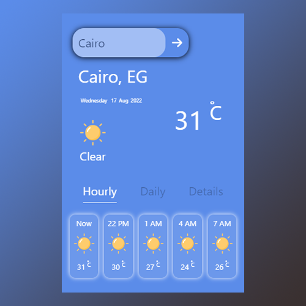

# Weather-App

## Desgin

### Features

1. 3 Hours Temperature 
2. Daily Temperature
3. Other Weather Description
   * Pressure
   * Humidity
   * Wind Speed
   * Visibility
   * Clouds Precent

### Technologies used:
* HTML
* CSS
* JavaScript
* React
* Weather API

### Demo Page here : https://omarmmohhammedd.github.io/Weather-App/
